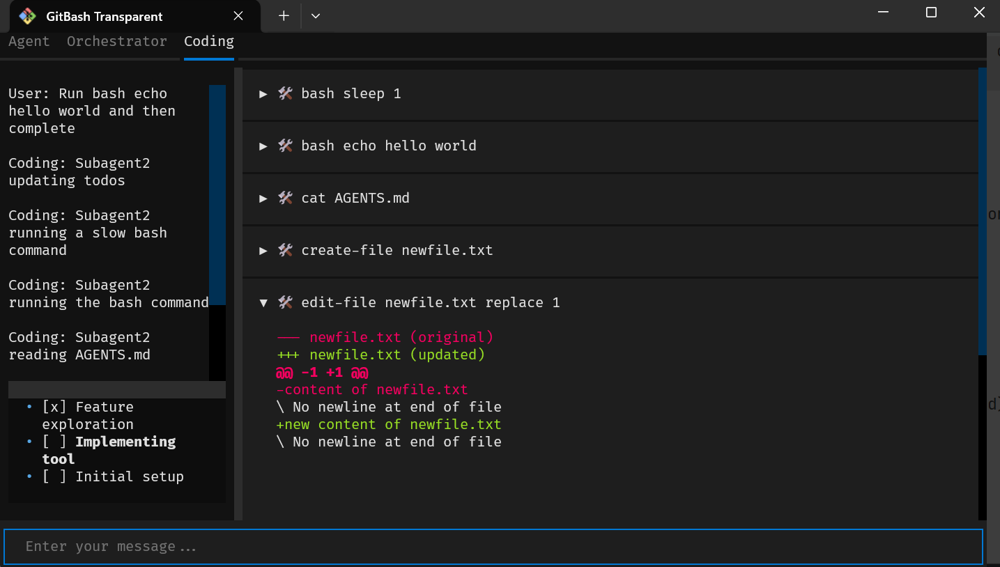

# Simple Agent

[](https://github.com/gregorriegler/simple-agent/actions/workflows/tests.yml)

Simple Agent aims to be a simple, extensible, and transparent general-purpose agent system.



## Features

- Transparency: observe every tool call and agent decision with ease
- Markdown-driven subagents: build modular agents from simple markdown files
- Token-efficient tool calling: optimized tool execution to reduce overhead
- CLI-first design: built for command-line use, with optional non-interactive mode
- API integration: works with OpenAI and Anthropic APIs

## Installation and Usage

### Quick install (recommended)
```bash
./install.sh
```

### Usage method 1: shell wrapper (recommended for development)
```bash
./agent.sh "your message here"
./agent.sh --continue            # continue previous session
./agent.sh --user-interface console
./agent.sh --system-prompt       # print rendered system prompt
./agent.sh --stub                # run against the built-in LLM stub
./agent.sh --non-interactive     # suppress interactive prompts
```

### Usage method 2: invoke the script with uv
```bash
uv run --project . --script simple_agent/main.py "your message here"
uv run --project . --script simple_agent/main.py --help
```

### Install globally with uv
```bash
uv tool install .
agent "your message here"
```

### Examples
```bash
# Start an interactive session using the default textual UI
./agent.sh "say hello"

# Run in the console UI and continue the previous session
./agent.sh --user-interface console --continue
```

## Configuration

Create a `.simple-agent.toml` file either in your home directory or in the directory where you run the agent. Values from the current directory override those from `~`.

```toml
[model]
model = "claude-sonnet-4-5-20250929"
adapter = "claude" # or "openai"
api_key = "your-api-key-here"
# base_url = "https://openrouter.ai/api/v1" # Optional when using the OpenAI adapter
```

All values inside `[model]` are required; pick the adapter that matches the infrastructure client you want to use.

When using the OpenAI adapter you can point the client at a compatible provider by overriding `base_url`, e.g. set it to `https://openrouter.ai/api/v1` for OpenRouter.

## Direct tool usage

You can execute a single tool call without starting a full session:

```bash
uv run --project . --script simple_agent/run_tool.py bash "echo hello"
uv run --project . --script simple_agent/run_tool.py cat README.md
```

## Development

```bash
# Run tests
./test.sh

# Approve received files
./approve.sh

# Generate coverage locally
./coverage.sh
```

## Components

- [`simple_agent/main.py`](simple_agent/main.py): CLI entry point that wires the event bus, user interface, Claude client, and tool library before running a session.
- [`simple_agent/application/session.py`](simple_agent/application/session.py): Orchestrates the lifecycle of a chat session, including streaming assistant output, tool execution, and persistence.
- [`simple_agent/application/agent.py`](simple_agent/application/agent.py): Core chat loop that gathers user input, streams Claude responses, and coordinates tool execution.
- [`simple_agent/tools/all_tools.py`](simple_agent/tools/all_tools.py): Registers built-in tools (bash, cat, edit_file, etc.), parses tool calls, and executes them.
- [`simple_agent/infrastructure/system_prompt/agent_definition.py`](simple_agent/infrastructure/system_prompt/agent_definition.py): Loads agent definitions and renders prompts that describe available tools to Claude.

## Text-to-Speech setup

The `say.py` script requires a Piper TTS voice model to function. Download the required model:

```bash
# Download the voice model (61MB)
curl -L -o en_US-lessac-medium.onnx "https://huggingface.co/rhasspy/piper-voices/resolve/v1.0.0/en/en_US/lessac/medium/en_US-lessac-medium.onnx"
curl -L -o en_US-lessac-medium.onnx.json "https://huggingface.co/rhasspy/piper-voices/resolve/v1.0.0/en/en_US/lessac/medium/en_US-lessac-medium.onnx.json"
```

Or use the provided script:
```bash
./download_voice_model.sh
```

Then use:
```bash
./say.py "Hello world"
# or
./say.sh "Hello world"
```
