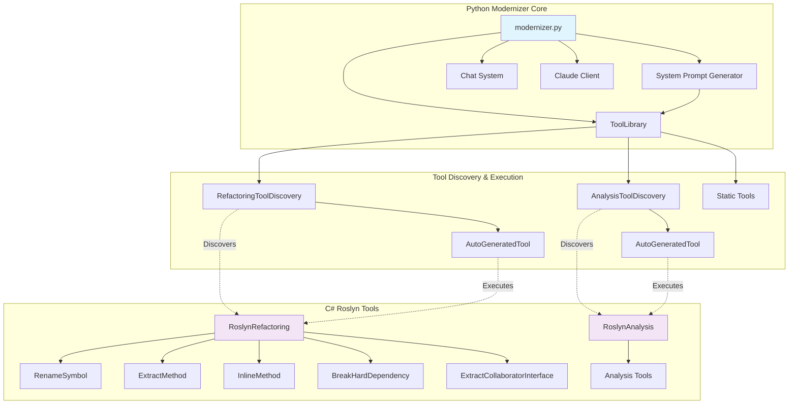

# Code Modernizer

A comprehensive code modernization toolkit that combines Python-based orchestration with C# Roslyn-powered refactoring tools to enable automated code analysis, refactoring, and modernization workflows.

## Architecture Overview



## Components

### Python Modernizer Core

#### [`modernizer.py`](modernizer/modernizer.py:1)
Agent that manages chat sessions with Claude AI, integrates tool execution, and coordinates the modernization workflow.

#### [`ToolLibrary`](modernizer/tools/tool_library.py:13)
Central registry and execution engine for all available tools, combining static tools with dynamically discovered C# refactoring tools.

**Features:**
- Auto-discovery of C# refactoring tools via [`RefactoringToolDiscovery`](modernizer/tools/refactoring_tool_discovery.py:6)
- Tool execution with [`parse_and_execute()`](modernizer/tools/tool_library.py:65)
- Command-line interface with [`runcommand()`](modernizer/tools/tool_library.py:80)

#### [`SystemPromptGenerator`](modernizer/system_prompt_generator.py:3)
Dynamically generates system prompts for Claude AI by discovering and documenting available tools.

### C# Roslyn Refactoring Tools

#### [`RenameSymbol`](refactoring-tools/RoslynRefactoring/RenameSymbol.cs:11)
Renames C# symbols (variables, methods, properties, classes) at specified cursor locations.

**Usage:** Cursor position + new name → Updated symbol references

#### [`ExtractMethod`](refactoring-tools/RoslynRefactoring/ExtractMethod.cs:12)
Extracts selected code into a new method with appropriate parameters and return values.

**Usage:** Code selection + method name → New method + method call

#### [`InlineMethod`](refactoring-tools/RoslynRefactoring/InlineMethod.cs:10)
Inlines method calls by replacing them with the method's body content.

**Usage:** Method call cursor → Inlined method body

#### [`BreakHardDependency`](refactoring-tools/RoslynRefactoring/BreakHardDependency.cs:21)
Refactors singleton dependencies into constructor-injected dependencies.

**Usage:** Field selection → Constructor injection pattern

#### [`ExtractCollaboratorInterface`](refactoring-tools/RoslynRefactoring/ExtractCollaboratorInterface.cs:13)
Creates interfaces from collaborator classes and updates dependencies.

**Usage:** Collaborator type selection → Interface extraction + dependency updates

### Tool Discovery System

#### [`RefactoringToolDiscovery`](modernizer/tools/refactoring_tool_discovery.py:6)
Automatically discovers C# refactoring tools by executing the RoslynRefactoring project with `--list-tools` flag.

**Features:**
- JSON-based tool metadata caching
- Dynamic tool registration
- [`AutoGeneratedTool`](modernizer/tools/auto_generated_tool.py) wrapper creation

#### [`AnalysisToolDiscovery`](modernizer/tools/analysis_tool_discovery.py)
Discovers C# code analysis tools from the RoslynAnalysis project.

### Static Tools

- **[`LsTool`](modernizer/tools/ls_tool.py)** - Directory listing functionality
- **[`CatTool`](modernizer/tools/cat_tool.py)** - File content display
- **[`TestTool`](modernizer/tools/test_tool.py)** - Test execution
- **[`CoverageTool`](modernizer/tools/coverage_tool.py)** - Code coverage analysis
- **[`RevertTool`](modernizer/tools/revert_tool.py)** - Git revert operations

### Chat & AI Integration

#### [`Chat`](modernizer/chat.py:8)
Immutable chat session management with message history persistence.

**Features:**
- [`load_chat()`](modernizer/chat.py:35) / [`save_chat()`](modernizer/chat.py:48) for session persistence
- Immutable message chain with [`userSays()`](modernizer/chat.py:17) / [`assistantSays()`](modernizer/chat.py:17)

#### [`claude_client.py`](modernizer/claude_client.py:6)
HTTP client for Anthropic's Claude API with proper message formatting.

## Usage

### Basic Modernization Session

```bash
# Start interactive modernization session
./modernizer.sh --new Modernize Project Xy

# Continue existing session
./modernizer.sh Optional Message
```

### Direct Tool Usage

```bash
./run_tool.sh ls .

# Execute refactoring
./run_tool.sh rename-symbol "1:5" "newVariableName"

# Run tests
./run_tool.sh test
```

### C# Tool Development

```bash
# Build refactoring tools
cd refactoring-tools

# Run tests
./test.sh

# List available refactorings
dotnet run --project RoslynRefactoring -- --list-tools
```

### Python Modernizer Development

```bash
cd modernizer

# Run tests
./test.sh

# Test the System Prompt
python system_prompt_generator.py
```