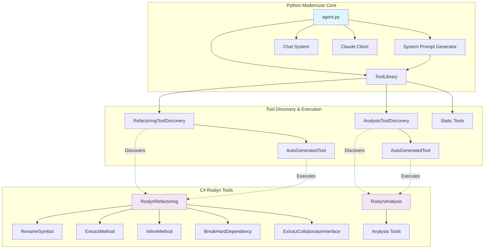

# Code Modernizer

A comprehensive code modernization toolkit that combines Python-based orchestration with C# Roslyn-powered refactoring tools to enable automated code analysis, refactoring, and modernization workflows.

## Architecture Overview



## Components

### Python Modernizer Core

#### [`agent.py`](agent.py:1)
Agent that manages chat sessions with Claude AI, integrates tool execution, and coordinates the modernization workflow.

#### [`ToolLibrary`](modernizer/tools/tool_library.py:13)
Central registry and execution engine for all available tools, combining static tools with dynamically discovered C# refactoring tools.

**Features:**
- Auto-discovery of C# refactoring tools via [`RefactoringToolDiscovery`](modernizer/tools/refactoring_tool_discovery.py:6)
- Tool execution with [`parse_and_execute()`](modernizer/tools/tool_library.py:65)
- Command-line interface with [`runcommand()`](modernizer/tools/tool_library.py:80)

#### [`SystemPromptGenerator`](modernizer/system_prompt_generator.py:3)
Dynamically generates system prompts for Claude AI by discovering and documenting available tools.

### Tool Discovery System

#### [`RefactoringToolDiscovery`](modernizer/tools/refactoring_tool_discovery.py:6)
Automatically discovers C# refactoring tools by executing the RoslynRefactoring project with `--list-tools` flag.

**Features:**
- JSON-based tool metadata caching
- Dynamic tool registration
- [`AutoGeneratedTool`](modernizer/tools/auto_generated_tool.py) wrapper creation

#### [`AnalysisToolDiscovery`](modernizer/tools/analysis_tool_discovery.py)
Discovers C# code analysis tools from the RoslynAnalysis project.

## Usage

### Basic Modernization Session

```bash
# Start interactive modernization session
./agent.sh --new Modernize Project Xy

# Continue existing session
./agent.sh Optional Message
```

### Direct Tool Usage

```bash
./list_tools.sh

./run_tool.sh ls .

# Execute refactoring
./run_tool.sh rename-symbol "1:5" "newVariableName"

# Run tests
./run_tool.sh test
```

### C# Tool Development

```bash
# Build refactoring tools
cd refactoring-tools

# Run tests
./test.sh

# Approve received files
./approve.sh

# List available refactorings
dotnet run --project RoslynRefactoring -- --list-tools
```

### Python Modernizer Development

```bash
cd .

# Run tests
./test.sh

# Approve received files
./approve.sh

# Test the System Prompt
./system_prompt.sh
```
