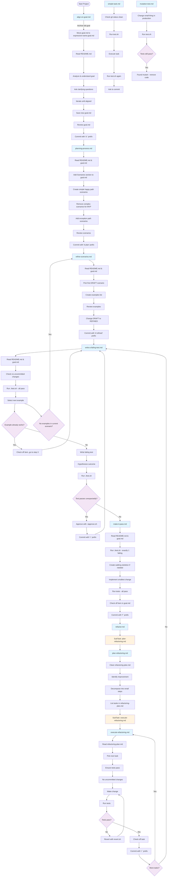

# Process Flow Analysis

## Current Process Flow

```mermaid
flowchart TD
    Start([Start Project]) --> AlignGoal[align-on-goal.md]
    
    AlignGoal --> |Archive old goal| A1[Move goal.md to expressive-name-goal.md]
    A1 --> A2[Read README.md]
    A2 --> A3[Analyze & understand goal]
    A3 --> A4[Ask clarifying questions]
    A4 --> A5[Iterate until aligned]
    A5 --> A6[Save new goal.md]
    A6 --> A7[Review goal.md]
    A7 --> A8[Commit with 'd ' prefix]
    A8 --> Planning[planning-process.md]
    
    Planning --> P1[Read README.md & goal.md]
    P1 --> P2[Add Scenarios section to goal.md]
    P2 --> P3[Create simple happy path scenarios]
    P3 --> P4[Remove complex scenarios for MVP]
    P4 --> P5[Add exception path scenarios]
    P5 --> P6[Review scenarios]
    P6 --> P7[Commit with 'd plan' prefix]
    P7 --> RefineScenarios[refine-scenarios.md]
    
    RefineScenarios --> R1[Read README.md & goal.md]
    R1 --> R2[Pick first DRAFT scenario]
    R2 --> R3[Create examples list]
    R3 --> R4[Review examples]
    R4 --> R5[Change DRAFT to REFINED]
    R5 --> R6[Commit with 'd refined' prefix]
    R6 --> WriteTest[write-a-failing-test.md]
    
    WriteTest --> W1[Read README.md & goal.md]
    W1 --> W2[Check no uncommitted changes]
    W2 --> W3[Run ./test.sh - all pass]
    W3 --> W4[Select next example]
    W4 --> W5{Example already works?}
    W5 --> |Yes| W6[Check off item, go to step 3]
    W5 --> |No| W7[Write failing test]
    W7 --> W8[Hypothesize outcome]
    W8 --> W9[Run ./test.sh]
    W9 --> W10{Test passes unexpectedly?}
    W10 --> |Yes| W11[Approve with ./approve.sh]
    W11 --> W12[Commit with 't ' prefix]
    W12 --> WriteTest
    W10 --> |No| MakePass[make-it-pass.md]
    
    MakePass --> M1[Read README.md & goal.md]
    M1 --> M2[Run ./test.sh - exactly 1 failing]
    M2 --> M3[Create walking skeleton if needed]
    M3 --> M4[Implement smallest change]
    M4 --> M5[Run tests - all pass]
    M5 --> M6[Check off item in goal.md]
    M6 --> M7[Commit with 'f ' prefix]
    M7 --> Refactor[refactor.md]
    
    Refactor --> RF1[SubTask: plan-refactoring.md]
    RF1 --> PlanRef[plan-refactoring.md]
    PlanRef --> PR1[Clean refactoring-plan.md]
    PR1 --> PR2[Identify improvement]
    PR2 --> PR3[Decompose into small steps]
    PR3 --> PR4[List tasks in refactoring-plan.md]
    PR4 --> RF2[SubTask: execute-refactoring.md]
    
    RF2 --> ExecRef[execute-refactoring.md]
    ExecRef --> ER1[Read refactoring-plan.md]
    ER1 --> ER2[Pick next task]
    ER2 --> ER3[Ensure tests pass]
    ER3 --> ER4[No uncommitted changes]
    ER4 --> ER5[Make change]
    ER5 --> ER6[Run tests]
    ER6 --> ER7{Tests pass?}
    ER7 --> |No| ER8[Revert with revert.sh]
    ER8 --> ER5
    ER7 --> |Yes| ER9[Check off task]
    ER9 --> ER10[Commit with 'r ' prefix]
    ER10 --> ER11{More tasks?}
    ER11 --> |Yes| ExecRef
    ER11 --> |No| WriteTest
    
    W4 --> W13{No examples in current scenario?}
    W13 --> |Yes| RefineScenarios
    W6 --> WriteTest
    
    %% Support processes
    SimpleTask[simple-task.md] --> ST1[Check git status clean]
    ST1 --> ST2[Run test.sh]
    ST2 --> ST3[Execute task]
    ST3 --> ST4[Run test.sh again]
    ST4 --> ST5[Ask to commit]
    
    MutationTest[mutation-test.md] --> MT1[Change small thing in production]
    MT1 --> MT2[Run test.sh]
    MT2 --> MT3{Tests still pass?}
    MT3 --> |Yes| MT4[Found mutant - remove code]
    
    %% Styling
    classDef processFile fill:#e1f5fe
    classDef subTask fill:#fff3e0
    classDef decision fill:#f3e5f5
    classDef action fill:#e8f5e8
    
    class AlignGoal,Planning,RefineScenarios,WriteTest,MakePass,Refactor,PlanRef,ExecRef,SimpleTask,MutationTest,DepBreaking processFile
    class RF1,RF2 subTask
    class W5,W10,ER7,ER11,W13,MT3 decision
```
