# Process Flow

This document contains a comprehensive mermaid diagram representing the development process workflow based on the process files.

```mermaid
flowchart TD
    Start([Start Project]) --> AlignGoal[💡 Align on Goal<br/>align-on-goal.md]
    
    AlignGoal --> ReadREADME[Read README.md]
    ReadREADME --> AnalyzeGoal[Analyze & understand goal]
    AnalyzeGoal --> AskQuestions{Questions about goal?}
    AskQuestions -->|Yes| NotifyUser[Notify using say.py]
    NotifyUser --> IterateGoal[Iterate on goal]
    IterateGoal --> AskQuestions
    AskQuestions -->|No| SaveGoal[Save goal.md]
    SaveGoal --> ReviewGoal[Ask for goal.md review]
    ReviewGoal --> CommitGoal[Commit: d aligned on goal...]
    CommitGoal --> Planning[📝 Planning Process<br/>planning-process.md]
    
    Planning --> ReadGoalPlanning[Read README.md & goal.md]
    ReadGoalPlanning --> CreateScenarios[Create Scenarios section in goal.md]
    CreateScenarios --> ThinkScenarios[Think of simple happy path scenarios]
    ThinkScenarios --> OrderScenarios[Order by simplicity ascending]
    OrderScenarios --> AddScenarios[Add scenarios with - DRAFT suffix]
    AddScenarios --> RemoveComplex[Remove complex scenarios for MVP]
    RemoveComplex --> AddExceptions[Add important exception scenarios]
    AddExceptions --> AskReview[Ask user to review scenarios]
    AskReview --> CommitPlan[Commit: d plan...]
    CommitPlan --> RefineScenarios[📝 Refine Scenarios<br/>refine-scenarios.md]
    
    RefineScenarios --> ReadGoalRefine[Read README.md & goal.md]
    ReadGoalRefine --> PickDraftScenario[Pick first DRAFT scenario]
    PickDraftScenario --> CheckScenarioSize{Can make scenario smaller?}
    CheckScenarioSize -->|Yes| CreateExamples[Create list of examples<br/>Zero/One/Many approach]
    CheckScenarioSize -->|No| MakeTask[Make scenario a checkable task]
    CreateExamples --> OrderExamples[Order examples by simplicity]
    OrderExamples --> AddTodoList[Add as todo list to goal.md]
    AddTodoList --> StopReview[Stop - Let user review examples]
    MakeTask --> StopReview
    StopReview --> ChangeStatus[Change - DRAFT to - REFINED]
    ChangeStatus --> CommitRefined[Commit: d refined...]
    CommitRefined --> Development[🔄 Development Process<br/>development-process.md]
    
    Development --> ReadGoalDev[Read goal.md]
    ReadGoalDev --> SelectExample[Select next example from task list]
    SelectExample --> CheckExamplesRemain{Examples remain in<br/>current scenario?}
    CheckExamplesRemain -->|No| BackToRefine[Back to Refine Scenarios]
    BackToRefine --> RefineScenarios
    CheckExamplesRemain -->|Yes| CheckTDDPhase{Check TDD Phase in goal.md}
    CheckTDDPhase -->|🔴 RED| WriteFailingTest[🔴 Write Failing Test<br/>write-a-failing-test.md]
    CheckTDDPhase -->|🟢 GREEN| MakeItPass[🟢 Make It Pass<br/>make-it-pass.md]
    CheckTDDPhase -->|🧹 REFACTOR| RefactorCode[🧹 Refactor<br/>refactor.md]
    CheckTDDPhase -->|No Phase| SetRed[Set phase to 🔴 and commit]
    SetRed --> WriteFailingTest
    
    WriteFailingTest --> CheckUncommitted{Uncommitted changes?}
    CheckUncommitted -->|Yes| StopNotify1[STOP - Notify with say.py]
    CheckUncommitted -->|No| RunTestsCheck[Run ./test.sh - all pass?]
    RunTestsCheck -->|No| StopNotify2[STOP - Notify with say.py]
    RunTestsCheck -->|Yes| AnalyzeCode[Analyze recent code for hardcoded/faked parts]
    AnalyzeCode --> FindIncomplete{Found incomplete implementation?}
    FindIncomplete -->|Yes| InsertExample[Insert minimum example before next]
    FindIncomplete -->|No| PickNextExample[Pick next example from goal.md]
    InsertExample --> PickNextExample
    PickNextExample --> CheckAlreadyWorks{Example already works<br/>& has test?}
    CheckAlreadyWorks -->|Yes| CheckOffItem[Check off item in goal.md]
    CheckOffItem --> WriteFailingTest
    CheckAlreadyWorks -->|No| WriteTest[Write simplest failing test]
    WriteTest --> HypothesizeOutcome[Hypothesize test outcome]
    HypothesizeOutcome --> RunTest[Run ./test.sh]
    RunTest --> TestPasses{Test passes unexpectedly?}
    TestPasses -->|Yes| ApproveTest[Approve with ./approve.sh]
    ApproveTest --> CommitTest[Commit: t ...]
    CommitTest --> WriteFailingTest
    TestPasses -->|No| SetGreenPhase[Set phase to 🟢 in goal.md]
    SetGreenPhase --> EndFailingTest[End: Added a failing Test]
    EndFailingTest --> Development
    
    MakeItPass --> ReadGoalMake[Read README.md & goal.md]
    ReadGoalMake --> RunTestsMake[Run ./test.sh]
    RunTestsMake --> OneFailingTest{Exactly one failing test?}
    OneFailingTest -->|No| StopProcess[STOP]
    OneFailingTest -->|Zero| EndNoFailing[End: No failing test found]
    OneFailingTest -->|Yes| ThinkDesign{Different design would<br/>make passing easier?}
    ThinkDesign -->|Yes| PrepRefactor[✨ Preparatory Refactoring<br/>preparatory-refactoring.md]
    ThinkDesign -->|No| MakeSmallestChange[Make smallest change to pass test]
    
    PrepRefactor --> RunTestsPrep[Run ./test.sh - one failing?]
    RunTestsPrep --> DisableTest[Disable the test]
    DisableTest --> RunTestsPass[Run tests - should pass]
    RunTestsPass --> CommitDisable[Commit: t ...]
    CommitDisable --> MakeDesignImprovement[Make desired design improvement]
    MakeDesignImprovement --> RunTestsStillPass[Run tests - should still pass]
    RunTestsStillPass --> CommitPrep[Commit: r preparatory ...]
    CommitPrep --> EndPrepSummary[End with summary]
    EndPrepSummary --> MakeItPass
    
    MakeSmallestChange --> TestsPass{Tests pass?}
    TestsPass -->|No| DebugTests[🤔 Debug<br/>debug.md]
    TestsPass -->|Yes| CheckWalkingSkeleton[Ensure walking skeleton exists]
    CheckWalkingSkeleton --> RunTestsConfirm[Run tests - confirm pass]
    RunTestsConfirm --> CheckOffExample[Check off example in goal.md]
    CheckOffExample --> CommitFeature[Commit: f ...]
    CommitFeature --> SetRefactorPhase[Set phase to 🧹 in goal.md]
    SetRefactorPhase --> EndMadePass[End: Made the test pass]
    EndMadePass --> Development
    
    DebugTests --> RunFailingTests[Run tests and see them fail]
    RunFailingTests --> MakeHypothesis[Make hypothesis on what's wrong]
    MakeHypothesis --> ProveHypothesis[Prove hypothesis with debug logging]
    ProveHypothesis --> FixIssue[Fix the issue]
    FixIssue --> RemoveDebugLogs[Remove all debug log statements]
    RemoveDebugLogs --> CommitFix[Commit: f ...]
    CommitFix --> MakeItPass
    
    RefactorCode --> EliminateDeadCode[💀 Eliminate Dead Code<br/>eliminate-dead-code.md]
    EliminateDeadCode --> RunCoverage[Run ./coverage.sh]
    RunCoverage --> FocusRemoval[Focus on lines to remove]
    FocusRemoval --> RemoveDeadCode[Remove dead code keeping tests passing]
    RemoveDeadCode --> TestsPassAfterRemoval{Tests pass after removal?}
    TestsPassAfterRemoval -->|Yes| CommitDeadCode[Commit: r dead code]
    TestsPassAfterRemoval -->|No| RevertChanges[Revert changes]
    CommitDeadCode --> AddTestsForUncovered[Add tests for lines that should be covered]
    AddTestsForUncovered --> CommitNewTests[Commit each test: t ...]
    CommitNewTests --> EndCoverage[End: Coverage analysis completed]
    RevertChanges --> AddTestsForUncovered
    
    EndCoverage --> AnalyzeDesign[Analyze code for design improvements]
    AnalyzeDesign --> FindSmallStep[Find small step towards better design]
    FindSmallStep --> DecomposeImprovement[Decompose improvement into small steps]
    DecomposeImprovement --> ExecuteSteps[Execute refactoring steps]
    ExecuteSteps --> RunTestsRefactor[Run ./test.sh before and after each step]
    RunTestsRefactor --> CommitRefactorStep[Commit each step: r ...]
    CommitRefactorStep --> SetRedPhase[Set phase to 🔴 in goal.md]
    SetRedPhase --> EndRefactor[End refactoring phase]
    EndRefactor --> Development
    
    %% Simple Task Process
    SimpleTask[✅ Simple Task<br/>simple-task.md] --> CheckGitClean[Check git status is clean]
    CheckGitClean --> RunTestsSimple[Run test.sh]
    RunTestsSimple --> ExecuteTask[Execute the task]
    ExecuteTask --> RunTestsAgain[Run test.sh again]
    RunTestsAgain --> AskCommit[Ask user to commit]
    
    %% Bash Scripts Guidelines
    BashScripts[📜 Write Bash Scripts<br/>write-bash-scripts.md] --> UseShebang[Use #!/usr/bin/env bash]
    UseShebang --> SetSafety[Use set -euo pipefail]
    SetSafety --> KeepMinimal[Keep scripts minimal]
    KeepMinimal --> MinimalValidation[Minimal input validation]
    MinimalValidation --> PortablePaths[Use portable paths]
    PortablePaths --> MakeExecutable[chmod +x script]
    MakeExecutable --> ConciseLogic[Prefer concise, direct logic]
    
    %% Styling
    classDef processFile fill:#e1f5fe,stroke:#01579b,stroke-width:2px
    classDef decision fill:#fff3e0,stroke:#e65100,stroke-width:2px
    classDef action fill:#f3e5f5,stroke:#4a148c,stroke-width:2px
    classDef endpoint fill:#e8f5e8,stroke:#2e7d32,stroke-width:2px
    classDef error fill:#ffebee,stroke:#c62828,stroke-width:2px
    
    class AlignGoal,Planning,RefineScenarios,Development,WriteFailingTest,MakeItPass,RefactorCode,PrepRefactor,DebugTests,EliminateDeadCode,SimpleTask,BashScripts processFile
    class AskQuestions,CheckExamplesRemain,CheckTDDPhase,CheckUncommitted,RunTestsCheck,FindIncomplete,CheckAlreadyWorks,TestPasses,OneFailingTest,ThinkDesign,TestsPass,TestsPassAfterRemoval decision
    class ReadREADME,AnalyzeGoal,SaveGoal,CreateScenarios,WriteTest,MakeSmallestChange,RunCoverage action
    class EndFailingTest,EndMadePass,EndCoverage,EndRefactor,EndNoFailing,EndPrepSummary endpoint
    class StopNotify1,StopNotify2,StopProcess error
```

## Process Overview

This workflow represents a comprehensive Test-Driven Development (TDD) process with the following key phases:

### 1. Project Initialization
- **Align on Goal**: Establish clear project objectives and save them in `goal.md`
- **Planning**: Create scenarios for the project features
- **Refine Scenarios**: Break scenarios into concrete, testable examples

### 2. TDD Development Loop
The core development follows a strict TDD cycle:
- **🔴 RED**: Write a failing test
- **🟢 GREEN**: Make the test pass with minimal code
- **🧹 REFACTOR**: Improve code design while keeping tests green

### 3. Supporting Processes
- **Debug**: Systematic approach to fixing failing tests
- **Preparatory Refactoring**: Improve design before implementing features
- **Eliminate Dead Code**: Remove untested code and improve coverage
- **Simple Task**: For straightforward, non-TDD tasks

### 4. Quality Assurance
- Git status checks before major operations
- Test execution before and after changes
- Code coverage analysis
- Systematic commit messages with risk-based prefixes

The process ensures continuous feedback, maintains code quality, and follows disciplined development practices throughout the project lifecycle.
