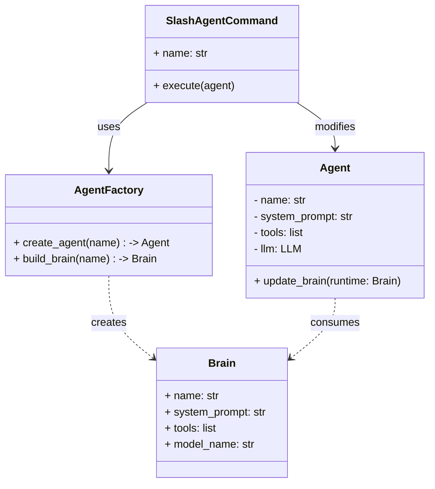

# Plan: Slash Command /agent

## Goal
Enable users to switch the active agent profile (persona, tools, model) within a live session using the `/agent` command, preserving chat history and session identity.

## Architecture

## Implementation Strategy
We will apply "Safe Refactoring" first by introducing the `Brain` concept without breaking existing flows, then implement the switching logic.

## Steps

### 0. Prerequisite Refactor: Single Typed Brain Seam
**Goal**: Prevent parallel runtime-assembly paths before feature work.
- [x] Introduce a typed internal seam in `AgentFactory`: `_build_brain(agent_id: AgentId, definition: AgentDefinition) -> Brain`.
- [x] Keep `create_agent(...)` as the only public construction path in this step.
- [x] Do not introduce a second public brain-construction API yet.
- [x] **Verification**: Run full `./test.sh`.

### 1. Preparation: Extract Brain
**Goal**: Decouple "defining configuration" from "instantiating Agent".
- [x] Create `simple_agent/application/brain.py` with `Brain` dataclass (name, system_prompt, tools, model_name).
- [x] Refactor `AgentFactory` to use the private typed `_build_brain(agent_id, definition) -> Brain` method.
- [x] Update `AgentFactory.create_agent` to use `_build_brain` then instantiate `Agent`.
- [x] Keep `Agent` construction single-path (`llm_provider + model_name`); do not add an optional runtime `llm` override.
- [x] **Verification**: Run existing tests to ensure no regression.

### 2. Domain Logic: Agent Switching
**Goal**: Allow an Agent instance to update its own brain.
- [x] Create a test case in `tests/application/agent_test.py` simulating a runtime switch (check system prompt change).
- [x] Add method `Agent.update_brain(self, runtime: Brain)` to `simple_agent/application/agent.py`.
    - Update `self._name`, `self._system_prompt`, `self._llm`, `self._tools`.
    - (Optional) Clear `self._tool_executor` if it's cached.
- [x] **Verification**: The test passes.

### 3. Application Logic: The Slash Command
**Goal**: Wire the `/agent` command to the logic.
- [ ] Create test `tests/slash_agent_command_test.py` covering:
    - Parsing `/agent developer`.
    - Execution calling `factory.build_brain` and `agent.update_brain`.
    - Handling invalid agent names.
- [x] Add a public brain-loading method in `AgentFactory` only when this step needs it (e.g. `build_brain(agent_id, agent_type)`), implemented via `read_agent_definition + _build_brain`.
- [ ] Update `simple_agent/application/slash_commands.py`:
    - Add `AgentCommand` dataclass.
    - Add `visit_agent_command` to `SlashCommandVisitor` interface.
- [x] Update `simple_agent/application/slash_command_registry.py` to register `/agent`.
- [x] Implement the command handler in `simple_agent/simple_agent/application/slash_command_executor.py` (or main loop handler).
    - Note: This might require injecting `AgentFactory` into the command handler context if not already present.

### 4. UI Feedback: Events
**Goal**: Notify the UI that the agent identity changed.
- [ ] Define `AgentChangedEvent` in `simple_agent/application/events.py`.
- [ ] Trigger this event inside `Agent.update_brain`.
- [ ] Update `simple_agent/infrastructure/textual/app.py` or relevant widget to subscribe to `AgentChangedEvent` and update the displayed Agent Name.

### 5. UX: Autocomplete
**Goal**: Help users find agents.
- [ ] Update `simple_agent/infrastructure/textual/smart_input/autocomplete/slash_commands.py`.
- [ ] Add logic to list available agent files from the `custom_agents` directory (or wherever `AgentFactory` looks).

## Links
- Spec: [docs/spec/slash-agent-command.spec.md](docs/spec/slash-agent-command.spec.md)
