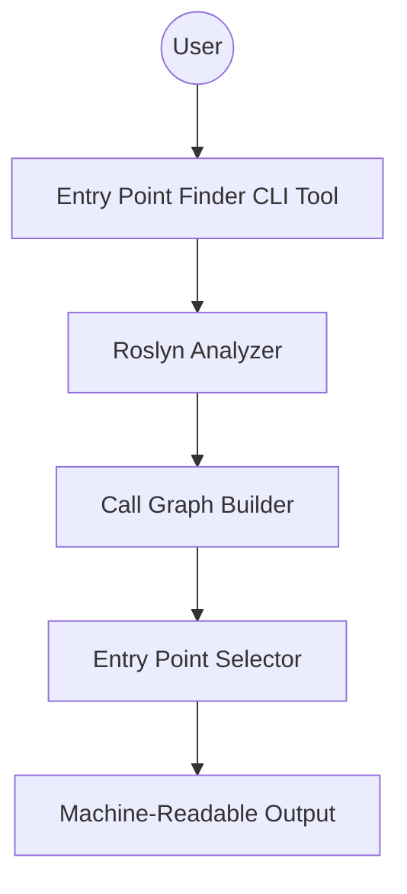

# Aligned Goal: Entry Point Finder for Characterization Testing

**Goal:**
Build a CLI tool (using Roslyn) that analyzes a legacy C# codebase, constructs a call graph, and outputs the smallest set of entry points (methods/functions) that together cover most of the code paths. The output should be a list of these entry points with metadata, formatted for use by another tool to generate characterization tests.

**Metadata for Each Entry Point:**
- Fully Qualified Name (namespace.class.method)
- File Path
- Line Number (start of method)
- Method Signature (parameters and return type)
- Reachable Methods Count (unique methods this entry point can reach)

**Implementation constraints:**
- CLI tool
- Uses Roslyn
- Output is machine-readable for downstream tools

---

## Component Diagram

---

## Scenarios (ordered by simplicity)

1. **Run tool on a small C# project**
   - Input: Path to a simple legacy C# solution or csproj
   - Output: List of entry points with metadata

2. **Run tool on a medium-sized project with multiple namespaces**
   - Input: Path to a moderately complex codebase
   - Output: Entry points covering most code paths, grouped by namespace

3. **Run tool with output redirected to a file**
   - Input: CLI flag to specify output file
   - Output: Machine-readable file with entry point data

4. **Run tool on a large legacy solution with circular dependencies**
   - Input: Path to a large solution
   - Output: Entry points, handling circular references gracefully

5. **Integrate tool output with downstream characterization test generator**
   - Input: Use tool output as input to another tool
   - Output: Seamless handoff for automated test generation
