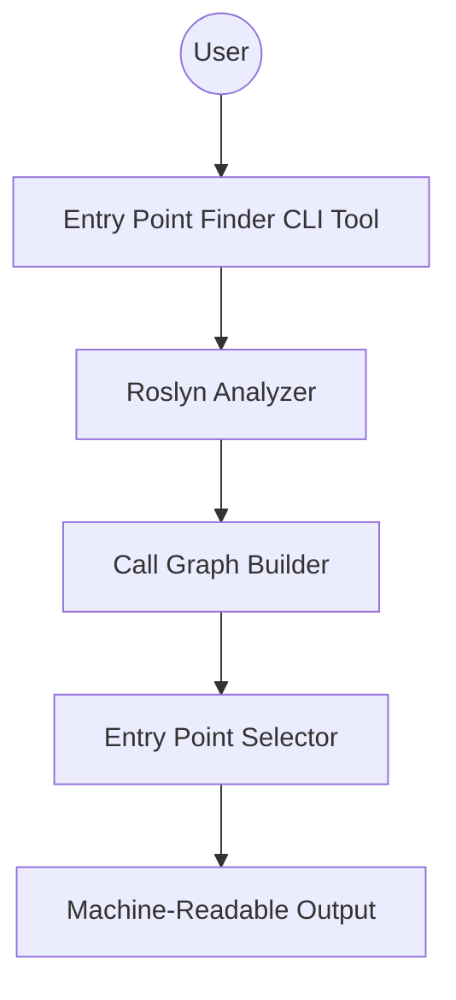

# Aligned Goal: Entry Point Finder for Characterization Testing

**Goal:**
Build a CLI tool (using Roslyn) that analyzes a legacy C# codebase, constructs a call graph, and outputs the smallest set of entry points (methods/functions) that together cover most of the code paths. The output should be a list of these entry points with metadata, formatted for use by another tool to generate characterization tests.

**Metadata for Each Entry Point:**
- Fully Qualified Name (namespace.class.method)
- File Path
- Line Number (start of method)
- Method Signature (parameters and return type)
- Reachable Methods Count (unique methods this entry point can reach)

**Implementation constraints:**
- CLI tool
- Uses Roslyn
- Output is machine-readable for downstream tools

---

## Component Diagram

---

## Scenarios (ordered by simplicity)

1. **Run tool on a small C# project**
   - Input: Path to a simple legacy C# solution or csproj
   - Output: List of entry points with metadata

   **Examples:**
   - *Single Class, Single Method*: A project with one file containing a single class and a single public method (e.g., `public void Main()`). The tool should identify this method as the only entry point and output its metadata.
   - *Single Class, Multiple Methods*: A project with one class containing several public methods (e.g., `Initialize()`, `Process()`, `Cleanup()`). The tool should output all methods that could serve as entry points, each with their metadata.
   - *Multiple Classes, Isolated Methods*: A project with two or three classes, each with one or more public methods, but no methods call each other. The tool should list each public method as a distinct entry point.
   - *Simple Call Chain*: A project where one public method calls another method within the same class or another class. The tool should identify the top-level method as the entry point and indicate the reachable methods count.
   - *Static Main Method*: A project with a standard `static void Main(string[] args)` entry point. The tool should recognize `Main` as the entry point and provide its metadata.
   - *Method with Parameters*: A class with a public method that takes parameters (e.g., `public int Add(int a, int b)`). The tool should output the method signature, including parameter types.
   - *Method Returning Value*: A public method that returns a value (e.g., `public string GetName()`). The output should include the return type in the metadata.

2. **Run tool on a medium-sized project with multiple namespaces**
   - Input: Path to a moderately complex codebase
   - Output: Entry points covering most code paths, grouped by namespace

3. **Run tool with output redirected to a file**
   - Input: CLI flag to specify output file
   - Output: Machine-readable file with entry point data

4. **Run tool on a large legacy solution with circular dependencies**
   - Input: Path to a large solution
   - Output: Entry points, handling circular references gracefully

5. **Integrate tool output with downstream characterization test generator**
   - Input: Use tool output as input to another tool
   - Output: Seamless handoff for automated test generation
