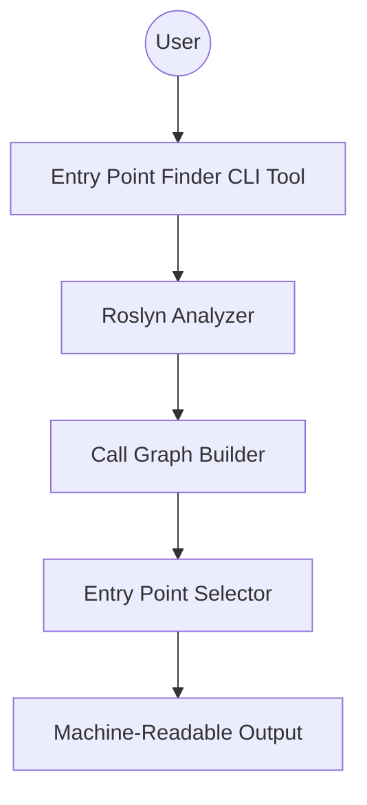

# Aligned Goal: Entry Point Finder for Characterization Testing

**Goal:**
Build a CLI tool (using Roslyn) that analyzes a legacy C# codebase, constructs a call graph, and outputs the smallest set of entry points (methods/functions) that together cover most of the code paths. The output should be a list of these entry points with metadata, formatted for use by another tool to generate characterization tests.

**Metadata for Each Entry Point:**
- Fully Qualified Name (namespace.class.method)
- File Path
- Line Number (start of method)
- Method Signature (parameters and return type)
- Reachable Methods Count (unique methods this entry point can reach)

**Implementation constraints:**
- CLI tool
- Uses Roslyn
- Output is machine-readable for downstream tools

---

## Component Diagram

---

## Context
- We are working in the RoslynAnalysis project
- Follow the [development process](../../process/development-process.md)
- Follow the [coding guidelines](../style-guide-csharp.md)

## Scenarios (ordered by simplicity)

1. **Run tool on a small C# project**
   - Input: Path to a simple legacy C# solution or csproj
   - Output: List of entry points with metadata

   **Testlist:**
   - [x] Create a C# project with a single class containing a single public method. Run the tool and verify it identifies this method as the only entry point and outputs its metadata.
   - [x] Create a C# project with one class containing multiple public methods. Run the tool and verify it outputs all public methods as entry points, each with their metadata.
   - [x] Create a C# project with two or three classes, each with one or more public methods, and ensure no methods call each other. Run the tool and verify each public method is listed as a distinct entry point.
   - [x] Create a C# project where a public method calls another method within the same or another class. Run the tool and verify it identifies the top-level method as the entry point and includes the count of reachable methods.
   - [x] Create a C# project with a standard `static void Main(string[] args)` entry point. Run the tool and verify it recognizes `Main` as the entry point and outputs its metadata.
   - [x] Create a C# project with a public method that takes parameters (e.g., `public int Add(int a, int b)`). Run the tool and verify the method signature, including parameter types, is included in the output.
   - [x] Create a C# project with a public method that returns a value (e.g., `public string GetName()`). Run the tool and verify the return type is included in the metadata.
   - [x] handling circular references gracefully
   - [x] dotnet run --project-path ../../../Parrot-Refactoring-Kata/CSharp/parrot.sln - Successfully loads solution files and analyzes all projects within the solution. Found 12 entry points from the Parrot Refactoring Kata project.
