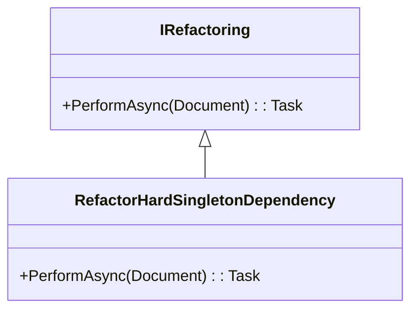

### 🎯 Goal

Transform singleton-based hard dependencies into constructor-injected dependencies to improve testability and modularity.

---

### 🧩 Component Diagram (Mermaid)



---

✅ Testlist: Refactor hard singleton dependency (Scenario 1)
This is a list of minimal, incremental test cases the refactoring tool should pass, ordered by simplicity:

- [x] Handle zero hard dependencies — if the class uses no singleton, refactoring should make no changes.
- [x] Handle one hard dependency and no constructor — the class uses OrderRepository.Instance and has no constructor; the tool should generate a constructor accepting OrderRepository.
- [x] Handle one hard dependency and an existing constructor — the class uses OrderRepository.Instance and has a constructor taking ProductCatalog; the tool should add OrderRepository as a parameter and use it for the field.
- [x] Update callers — when a class constructor is modified, update all callers to use the new constructor signature.


---

### 🔧 Refactoring Class Outline

```csharp
public class BreakHardDependency : IRefactoring
{
    public async Task<Document> PerformAsync(Document document)
    {
        // 1. Parse syntax tree and semantic model
        // 2. Find fields assigned as Singleton.Instance
        // 3. Replace initialization with constructor-assigned field
        // 4. Add a new constructor if needed
        // 5. Replace usages of old constructor (optional)
        // 6. Return updated document
    }
}
```

